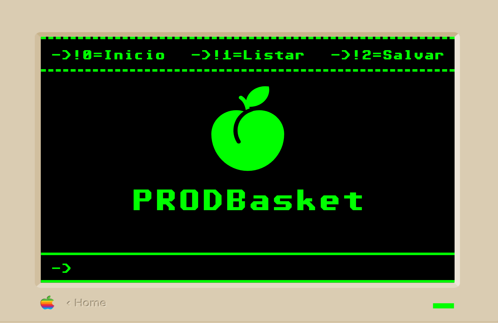
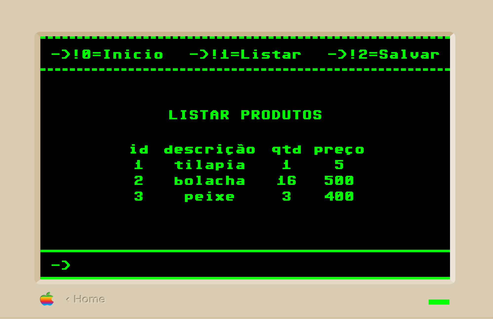
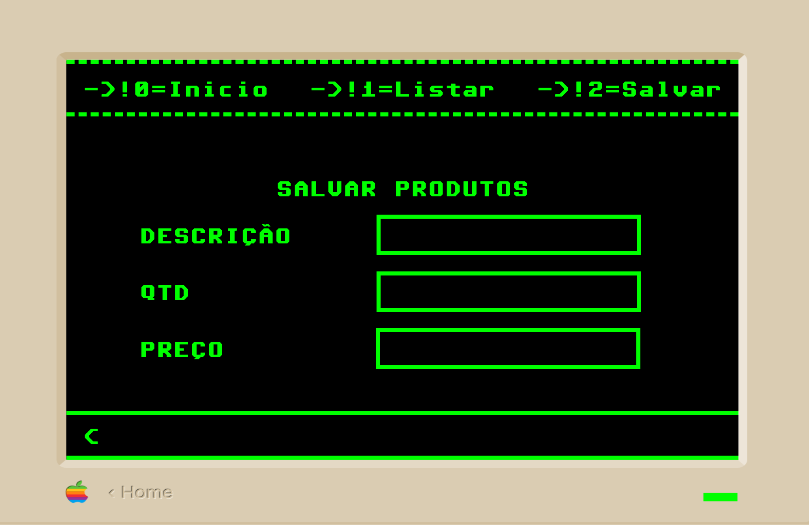
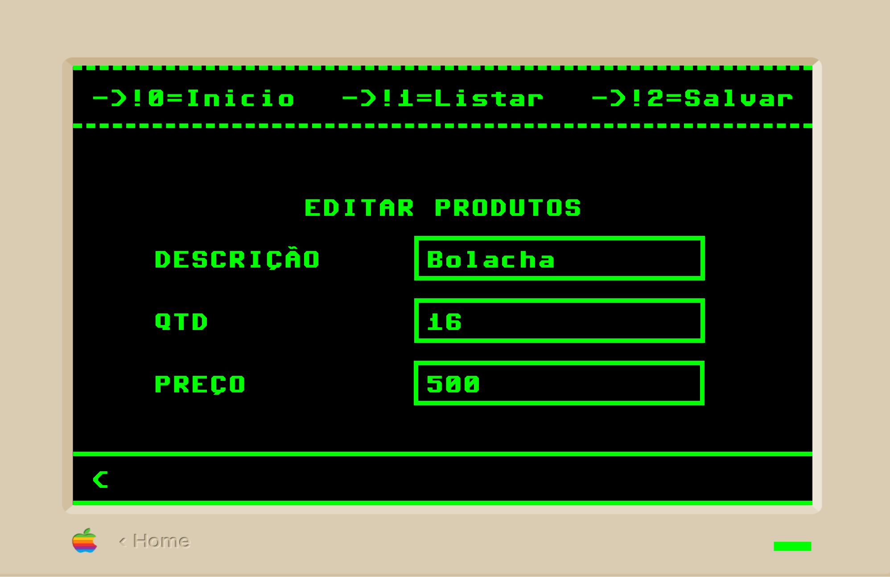

# PRODBasket

O ProdBasket é um pequeno sistema de controle de estoque

O sistema roda em um servidor Nginx com o PHP.

Para rodar ele só mandando todos os ficheiros para um servidor.

## Listar produtos

## Comandos necessários para usar o sistema

Ele usa uma espécie de CLI para manipular o sistema

!0 = leva para o menu-principal

!1 = listar os produtos do sistema

!2 = leva para a janela de salvar produtos

!edit/{$id} = serve para editar um produto

!del/{$id} = serve para apagar um produto

!report/0 = serve para gerar um relatório geral de todos os produtos

## Salvar produtos

Para salvar os produtos basta preencher o formuário e depois dar um enter na linha de comandos

## Editar produtos

Para editar um produto precisa digitar: !edit/{$id}

Ex: !edit/1

Ele vai levar para uma janela com os dados dos produtos para serem editados
